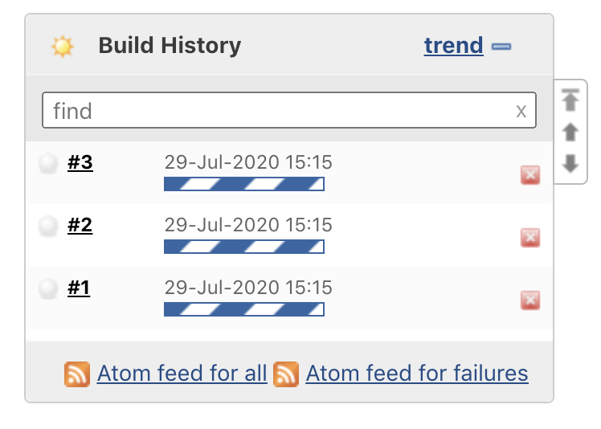
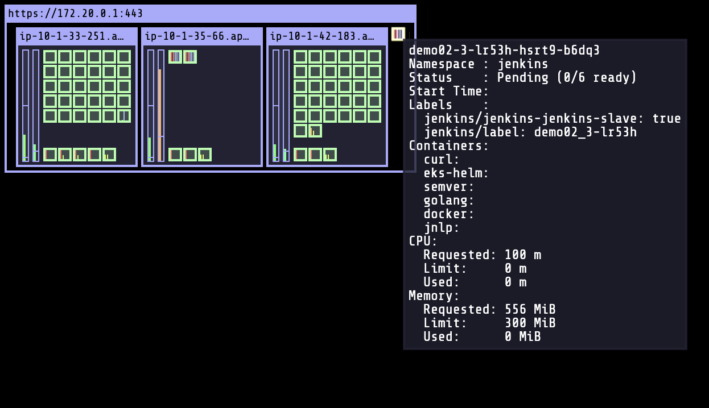

# COSCUP jenkins demo

[](https://gitpod.io/#https://github.com/RicoToothless/coscup-jenkins-demo)

# Getting Start

Prepare your Gitpod environment. Just click this button. [](https://gitpod.io/#https://github.com/RicoToothless/coscup-jenkins-demo)

Export your AWS credential to the environment.  Please do not use `aws configure` command line. AWS CDK still not support aws cli v2. If you don't know how to get AWS credential. Please check [Jenkins Workshop create IAM slide](https://docs.google.com/presentation/d/1WApH5JjlhcJ5YCVIE-It5vdTAcrUaKHOgBfuIGqP18k/edit#slide=id.g64f1b54b32_1_103)

```
$ export AWS_ACCESS_KEY_ID=
$ export AWS_SECRET_ACCESS_KEY=
$ export AWS_DEFAULT_REGION=ap-northeast-2
```

Start to deploy our infrastructure, Jenkins, kube-ops-view. It would spend up to 30 minutes

```
$ cd 01-install-eks-cluster/ && bash install.sh
```

Jenkins needs 3~10 minutes to initialization.

Get kube-config and Jenkins & kube-ops-view demo links.

```
$ cd ../02-jenkins-demo/ && bash get-kube-config.sh && bash get-link.sh
```

## demo01

After clicking Jenkins job `Build Now` button would run on the specific node like this.


## demo02

Need to click Jenkins job `Build Now` button more than 3 times for reaching resources limits.




# Clean up

Clean up all of the resources.

```
$ cd ../uninstall/ && bash uninstall.sh

```

# COSCUP2020 Record
* Slide : [Dynamic Jenkins Agent on Kubernetes X Slide](https://docs.google.com/presentation/d/1Kh3GZRYhioeGA8DFo4f4YM3aDQseM4UtTCfw_os4osc/edit#slide=id.p)

* Youtube : [Dynamic Jenkins Agent on Kubernetes X COSCUP Youtube Channel](https://www.youtube.com/watch?v=suh5BbPpwVE)

